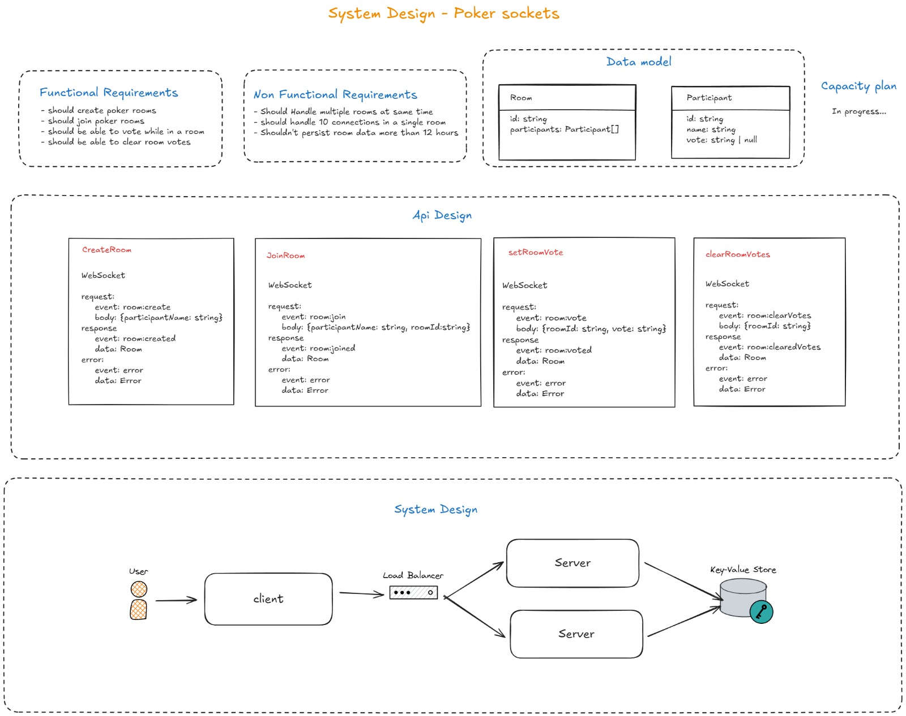

# poker-socket

<p>
  
  
  
  
</p>

This Repository is for a scrum poker aplication Using webSockets for communication

My goal is to create a distributed application that allows users to play Scrum Poker with real-time state updates for better voting sessions.

In the first diagram, when I was thinking about the functionalities of this project, I came up with the following result:



A system with four main functions centered around Scrum Poker room management.

I decided to use a key-value store database because each room has its own data. Since I don’t need or want to persist data, I’ve been considering using Redis from the start because of its high availability.

For the UI, I am trying out Angular to expand my horizons.

## summary

- [poker-socket](#poker-socket)
  - [summary](#summary)
  - [backend](#backend)
    - [Run](#run)
      - [Develop](#develop)
      - [Production](#production)
    - [TO DO](#to-do)
  - [frontend](#frontend)
    - [Run](#run-1)
      - [Develop](#develop-1)
      - [production](#production-1)
    - [TO DO](#to-do-1)

## backend

Node.js project using [socket.io](https://socket.io/) to create and manage websockets connections

### Run

#### Develop

Run inside a container with docker:

- start services if not started yet

```bash
docker compose up
```

- access container shell

```bash
docker compose exec backend sh
```

- run the start command in the container shell

```sh
npm run start-dev
```

#### Production

Build a docker image with command:

```bash
docker build -f ./backend/.docker/Dockerfile -t poker-socket-backend:1.0.0 ./backend
```


### TO DO

- [] Add error trancing (Maybe Sentry?)
- [] Add a data mapper for Room entity to Json (This is to return correct data to to diferent clients from the same base entity returned by usecases)
- [] Add Otel (Open telemetry) and export the data to some place (Jaegger, Grafana, ...)
- [] improve DDD, add base entities, work more with event domains and agregattes, use more value objects

## frontend

A interface created using [Angular](https://angular.dev/) with [tailwindcss](https://tailwindcss.com/)

Using [socket.io](https://socket.io/) to connect with the websocket server

Used icons is from the [phosphoricons](https://phosphoricons.com/) library

### Run

#### Develop

Run inside a container with docker:

- start services if not started yet

```bash
docker compose up
```

- access container shell

```bash
docker compose exec frontend sh
```

- run the start command in the container shell

```sh
npm run start
```


#### production

Build a docker image with command:

```bash
docker build -f ./frontend/.docker/Dockerfile -t poker-socket-frontend:1.0.0 ./frontend
```

### TO DO

- [] add unit tests
- [] improve system architecture
- [] improve error messages and ui


<br>

---

Developed by [Alessandro Massarotti Jr](https://github.com/alessandro-massarotti-jr) 🤖
